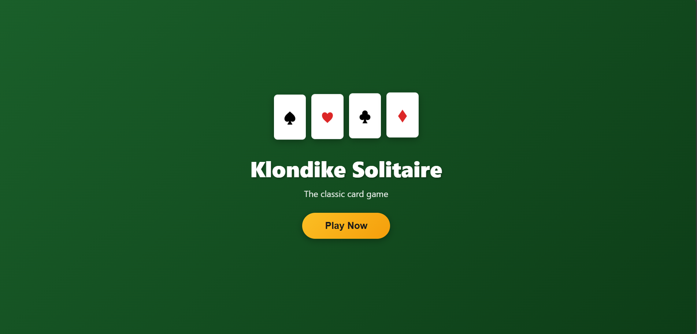
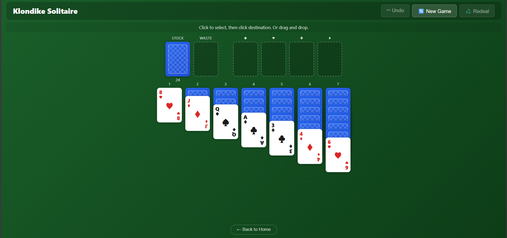
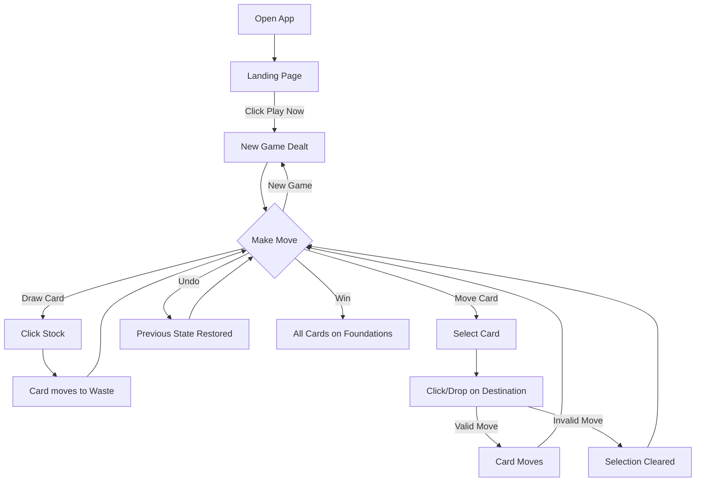

```markdown
# Klondike Solitaire

> A classic Klondike Solitaire card game built with React — fully responsive with touch support for mobile devices.

---

## Table of Contents

- [Overview](#overview)
- [Live Demo](#live-demo)
- [Tech Stack](#tech-stack)
- [Architecture](#architecture)
- [Features & User Flows](#features--user-flows)
- [Getting Started](#getting-started)
- [Project Scripts](#project-scripts)
- [Deployment](#deployment)
- [Usage Guide](#usage-guide)
- [Contributing](#contributing)
- [Roadmap](#roadmap)
- [License](#license)
- [Support / Contact](#support--contact)

---

## Overview

### What Problem It Solves

Klondike Solitaire provides a browser-based implementation of the classic single-player card game. It offers a clean, distraction-free gaming experience that works seamlessly across desktop and mobile devices without requiring any downloads or installations.

### Who It's For

- Casual gamers looking for a quick solitaire game
- Developers learning React game development patterns
- Anyone wanting an offline-capable card game (works after initial load)

### Key Features

- 🃏 **Classic Klondike Rules** — Standard 52-card deck with traditional gameplay
- 🖱️ **Dual Input Support** — Click-to-select or drag-and-drop on desktop
- 📱 **Full Touch Support** — Native touch drag gestures on mobile/tablet
- ↶ **Unlimited Undo** — Complete move history with multi-step undo
- ♻️ **Unlimited Redeals** — Recycle waste pile back to stock anytime
- 🎯 **Auto-Flip Cards** — Face-down cards automatically flip when exposed
- 📐 **Responsive Design** — Adapts to any screen size (desktop, tablet, mobile)
- ⚡ **Zero Dependencies** — Pure React with no external game/UI libraries
- 🚀 **Instant Load** — Lightweight bundle, no backend required
- 🎨 **Clean UI** — Modern card design with visual feedback for selections

### Screenshots

> **Note:** Add screenshots to a `/screenshots` folder and update paths below.
```





````

## Live Demo

| Environment | URL |
|-------------|-----|
| Production | `https://YOUR_USERNAME.github.io/klondike-solitaire` | (This is Fake for now!)

> Replace `YOUR_USERNAME` with your GitHub username after deployment.

---

## Tech Stack

| Layer | Technology | Version | Purpose |
|-------|------------|---------|---------|
| Framework | React | 18.2.0 | UI component library |
| DOM | react-dom | 18.2.0 | React DOM renderer |
| Build Tool | react-scripts | 5.0.1 | Create React App toolchain |
| Deployment | gh-pages | 6.1.0 | GitHub Pages deployment |
| Styling | CSS3 | — | Custom styles, no frameworks |
| Language | JavaScript | ES6+ | Application logic |

---

## Architecture

### High-Level Overview

This is a single-page React application with no backend. All game logic runs client-side in the browser.

```mermaid
flowchart TB
    subgraph Browser
        subgraph React Application
            Landing[Landing Page]
            Game[Game Board]

            subgraph Components
                App[App.js<br/>Main Logic]
                Card[Card.js<br/>Card Display]
            end

            subgraph State
                GameState[Game State<br/>stock, waste, tableau, foundations]
                History[History Stack<br/>Undo Support]
                Selection[Selection State<br/>Current Selection]
                TouchDrag[Touch Drag State<br/>Mobile Support]
            end
        end

        CSS[App.css<br/>Styling]
    end

    Landing -->|Play Now| Game
    App --> Card
    App --> GameState
    App --> History
    App --> Selection
    App --> TouchDrag
````

### Game State Flow

```mermaid
flowchart LR
    subgraph User Actions
        Click[Click/Tap]
        Drag[Drag/Touch]
        Undo[Undo Button]
        NewGame[New Game]
        Stock[Stock Click]
    end

    subgraph State Updates
        SaveHistory[Save to History]
        ValidateMove[Validate Move]
        UpdateState[Update Game State]
        AutoFlip[Auto-Flip Cards]
    end

    subgraph Render
        ReRender[Re-render UI]
    end

    Click --> ValidateMove
    Drag --> ValidateMove
    ValidateMove -->|Valid| SaveHistory
    SaveHistory --> UpdateState
    UpdateState --> AutoFlip
    AutoFlip --> ReRender
    ValidateMove -->|Invalid| ReRender

    Undo --> UpdateState
    NewGame --> UpdateState
    Stock --> SaveHistory
```

### Directory Structure

```
solitaire/
├── public/
│   └── index.html          # HTML entry point
├── src/
│   ├── components/
│   │   └── Card.js         # Card component (face-up, face-down rendering)
│   ├── App.js              # Main application logic & game state
│   ├── App.css             # All styles (responsive, animations)
│   └── index.js            # React DOM entry point
├── package.json            # Dependencies and scripts
└── README.md               # This file
```

### Key Files Explained

| File                     | Purpose                                                                                                                   |
| ------------------------ | ------------------------------------------------------------------------------------------------------------------------- |
| `src/App.js`             | Contains all game logic: state management, move validation, drag/drop handlers, touch handlers, card dealing, undo system |
| `src/components/Card.js` | Presentational component for rendering individual cards (face-up with rank/suit, or face-down with pattern)               |
| `src/App.css`            | Complete styling including responsive breakpoints, card designs, animations, touch optimizations                          |
| `public/index.html`      | Minimal HTML shell with viewport meta tags for mobile                                                                     |

---

## Features & User Flows

### Game Data Model

```javascript
// Card object
{
  id: "hearts-1",      // Unique identifier
  suit: "hearts",      // hearts, diamonds, clubs, spades
  rank: 1,             // 1-13 (1=Ace, 11=Jack, 12=Queen, 13=King)
  faceUp: true         // Visibility state
}

// Game state
{
  stock: Card[],           // Draw pile (face-down)
  waste: Card[],           // Drawn cards (face-up)
  foundations: Card[][],   // 4 piles, one per suit (Ace→King)
  tableau: Card[][]        // 7 piles, cascading layout
}
```

### Primary User Journey



### Move Validation Rules

| Move Type            | Rule                                                             |
| -------------------- | ---------------------------------------------------------------- |
| Tableau → Tableau    | Descending rank, alternating colors (Red on Black, Black on Red) |
| Any → Empty Tableau  | Only Kings allowed                                               |
| Any → Foundation     | Same suit, ascending rank (Ace first, then 2, 3... King)         |
| Foundation → Tableau | Allowed (for strategic play)                                     |
| Stock → Waste        | Always allowed (draws 1 card)                                    |
| Waste → Stock        | Allowed when stock empty (redeal)                                |

### Color Rules

| Suit       | Color |
| ---------- | ----- |
| Hearts ♥   | Red   |
| Diamonds ♦ | Red   |
| Clubs ♣    | Black |
| Spades ♠   | Black |

---

## Getting Started

### Prerequisites

| Requirement | Version        | Check Command    |
| ----------- | -------------- | ---------------- |
| Node.js     | 16.x or higher | `node --version` |
| npm         | 8.x or higher  | `npm --version`  |
| Git         | Any recent     | `git --version`  |

### Installation

```bash
# Clone the repository
git clone https://github.com/YOUR_USERNAME/klondike-solitaire.git

# Navigate to project directory
cd klondike-solitaire

# Install dependencies
npm install
```

### Environment Variables

**No environment variables required.** This is a fully client-side application with no external API calls or secrets.

### Running Development Server

```bash
npm start
```

- Opens automatically at [http://localhost:3000](http://localhost:3000)
- Hot reloading enabled — changes reflect instantly
- Works on local network for mobile testing (check terminal for network URL)

### Running Tests

```bash
npm test
```

Launches the test runner in interactive watch mode.

### Linting

Create React App includes ESLint. Linting runs automatically during development and build.

```bash
# Check for lint errors during build
npm run build
```

### Troubleshooting

| Issue                         | Solution                                                                    |
| ----------------------------- | --------------------------------------------------------------------------- |
| `npm install` fails           | Delete `node_modules` and `package-lock.json`, then run `npm install` again |
| Port 3000 in use              | Kill the process using port 3000, or set `PORT=3001 npm start`              |
| Cards not draggable on mobile | Ensure you're touching directly on the card, not empty space                |
| Touch not working             | Check browser console for errors; ensure touch events aren't blocked        |
| Blank screen                  | Clear browser cache; check console for JavaScript errors                    |
| Styles broken                 | Hard refresh with `Ctrl+Shift+R` (Windows) or `Cmd+Shift+R` (Mac)           |

---

## Project Scripts

| Script      | Command             | Description                                               |
| ----------- | ------------------- | --------------------------------------------------------- |
| `start`     | `npm start`         | Starts development server on port 3000 with hot reloading |
| `build`     | `npm run build`     | Creates optimized production build in `/build` folder     |
| `test`      | `npm test`          | Runs test suite in interactive watch mode                 |
| `eject`     | `npm run eject`     | Ejects from Create React App (one-way, not recommended)   |
| `predeploy` | `npm run predeploy` | Automatically runs before deploy (builds the app)         |
| `deploy`    | `npm run deploy`    | Deploys to GitHub Pages using gh-pages branch             |

---

## Deployment

### GitHub Pages (Recommended)

#### 1. Update `package.json`

Ensure your `package.json` has the homepage field:

```json
{
  "homepage": "https://YOUR_USERNAME.github.io/klondike-solitaire"
}
```

Replace `YOUR_USERNAME` with your actual GitHub username.

#### 2. Deploy

```bash
npm run deploy
```

This command:

1. Runs `npm run build` (via `predeploy`)
2. Pushes the `/build` folder to the `gh-pages` branch
3. GitHub Pages serves from this branch automatically

#### 3. Configure GitHub Pages

1. Go to repository → **Settings** → **Pages**
2. Under "Source", select **gh-pages** branch
3. Click **Save**
4. Wait 2-5 minutes for deployment

#### 4. Access Your Site

```
https://YOUR_USERNAME.github.io/klondike-solitaire
```

### Alternative Platforms

#### Netlify

```bash
# Build the project
npm run build

# Deploy build folder to Netlify
# Drag and drop /build folder to netlify.com/drop
# Or connect GitHub repo for automatic deploys
```

**Netlify Settings:**

- Build command: `npm run build`
- Publish directory: `build`

#### Vercel

```bash
# Install Vercel CLI
npm install -g vercel

# Deploy
vercel
```

### Production Build Details

```bash
npm run build
```

Creates a `/build` folder containing:

- Minified JavaScript bundles
- Optimized CSS
- Static assets
- `index.html` entry point

Build output is ~200KB gzipped (React + game code + styles).

---

## Usage Guide

### For End Users

#### How to Play

1. **Start**: Click "Play Now" on the landing page
2. **Objective**: Move all 52 cards to the four foundation piles (top-right), sorted by suit from Ace to King

#### Controls

| Action          | Desktop                             | Mobile                               |
| --------------- | ----------------------------------- | ------------------------------------ |
| Select card     | Click on card                       | Tap on card                          |
| Move card       | Click destination, or drag & drop   | Tap destination, or drag with finger |
| Draw from stock | Click stock pile                    | Tap stock pile                       |
| Redeal          | Click empty stock, or Redeal button | Tap empty stock, or Redeal button    |
| Undo            | Click Undo button                   | Tap Undo button                      |
| New game        | Click New Game button               | Tap New Game button                  |

#### Game Rules Quick Reference

- **Tableau (7 columns)**: Build down, alternating colors
  - ✅ Black 7 on Red 8
  - ❌ Red 7 on Red 8
- **Foundation (4 piles)**: Build up by suit
  - ✅ ♥2 on ♥A
  - ❌ ♦2 on ♥A
- **Empty column**: Only Kings can be placed
- **Stock**: Click to draw one card to waste

### For Developers

#### Adding a New Feature

1. Game logic modifications go in `src/App.js`
2. New components go in `src/components/`
3. Styles go in `src/App.css`
4. Test on both desktop and mobile

#### Key Functions in App.js

| Function                      | Purpose                                 |
| ----------------------------- | --------------------------------------- |
| `dealNewGame()`               | Shuffles deck and deals initial tableau |
| `canMoveToTableau()`          | Validates tableau move rules            |
| `canMoveToFoundation()`       | Validates foundation move rules         |
| `tryMove()`                   | Attempts a move, updates state if valid |
| `handleTouchStart/Move/End()` | Mobile touch drag handling              |
| `findDropTarget()`            | Detects drop location for touch events  |
| `autoFlip()`                  | Flips exposed face-down cards           |
| `saveHistory()`               | Saves state for undo functionality      |

#### State Management Pattern

```javascript
// All state in App component
const [gameState, setGameState] = useState(null); // Card positions
const [history, setHistory] = useState([]); // Undo stack
const [selection, setSelection] = useState(null); // Selected cards
const [touchDrag, setTouchDrag] = useState(null); // Touch drag state
```

#### Adding a New Card Action

```javascript
// 1. Create validation function
const canDoNewAction = (cards, target) => {
  // Return true/false
};

// 2. Add handler
const handleNewAction = useCallback(() => {
  if (canDoNewAction(...)) {
    saveHistory(gameState);
    // Update state
    setGameState(prev => ({ ...prev, /* changes */ }));
  }
}, [gameState, saveHistory]);

// 3. Wire up to UI element
<button onClick={handleNewAction}>New Action</button>
```

---

## Contributing

### Branch Strategy

| Branch      | Purpose                                                |
| ----------- | ------------------------------------------------------ |
| `main`      | Production-ready code                                  |
| `gh-pages`  | Auto-generated by deploy script (do not edit manually) |
| `feature/*` | New features                                           |
| `fix/*`     | Bug fixes                                              |

### Pull Request Process

1. Fork the repository
2. Create a feature branch:
   ```bash
   git checkout -b feature/your-feature-name
   ```
3. Make your changes
4. Test on desktop AND mobile
5. Commit with clear messages:
   ```bash
   git commit -m "Add: description of feature"
   git commit -m "Fix: description of bug fix"
   ```
6. Push to your fork:
   ```bash
   git push origin feature/your-feature-name
   ```
7. Open a Pull Request against `main`

### Code Style

- Use functional components with hooks
- Use `useCallback` for functions passed as props or used in dependencies
- Keep state immutable (spread operators, `map`, `filter`)
- Use descriptive variable names
- Comment complex logic

### Pre-PR Checklist

- [ ] App runs without console errors
- [ ] Works on desktop (Chrome, Firefox, Safari)
- [ ] Works on mobile (iOS Safari, Android Chrome)
- [ ] Touch drag works on mobile
- [ ] Undo works correctly for all actions
- [ ] Responsive layout intact at all breakpoints
- [ ] `npm run build` succeeds without errors

---

## Roadmap

### Planned Improvements

- [ ] Win detection and celebration animation
- [ ] Game statistics (games played, won, win rate)
- [ ] Timer and scoring system (optional toggle)
- [ ] Auto-complete when game is clearly won
- [ ] Sound effects (with mute option)
- [ ] Dark mode theme
- [ ] Keyboard shortcuts (arrow keys, Enter, Ctrl+Z)
- [ ] Save/restore game state (localStorage)
- [ ] Multiple card draw option (draw 1 vs draw 3)

### Known Limitations

- No persistent storage (refresh loses game)
- No multiplayer or leaderboards
- No accessibility features (screen reader support)

---

## License

No license file found in repository.

> Consider adding an MIT or Apache 2.0 license for open-source distribution.

---

## Support / Contact

### Reporting Issues

1. Check existing [Issues](../../issues) to avoid duplicates
2. Create a new issue with:
   - Clear title describing the problem
   - Steps to reproduce
   - Expected vs actual behavior
   - Device/browser information
   - Screenshots if applicable

### Feature Requests

Open an issue with the `enhancement` label describing:

- The feature you'd like
- Why it would be useful
- Any implementation ideas

### Security

This application:

- Runs entirely client-side
- Makes no network requests
- Stores no user data
- Has no authentication

If you discover a security issue with the codebase, please open an issue.

---

## Quick Reference Card

```
┌─────────────────────────────────────────────────────────────┐
│                    KLONDIKE SOLITAIRE                       │
├─────────────────────────────────────────────────────────────┤
│  npm install          Install dependencies                  │
│  npm start            Start dev server (localhost:3000)     │
│  npm run build        Create production build               │
│  npm run deploy       Deploy to GitHub Pages                │
├─────────────────────────────────────────────────────────────┤
│  src/App.js           Main game logic                       │
│  src/App.css          All styles                            │
│  src/components/      React components                      │
├─────────────────────────────────────────────────────────────┤
│  Tableau: Descending, alternating colors                    │
│  Foundation: Ascending, same suit (Ace → King)              │
│  Empty column: Kings only                                   │
└─────────────────────────────────────────────────────────────┘
```

---

Made with ❤️ using React

```

```
